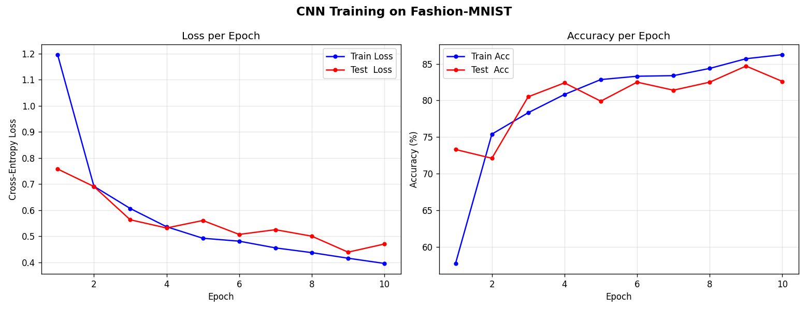
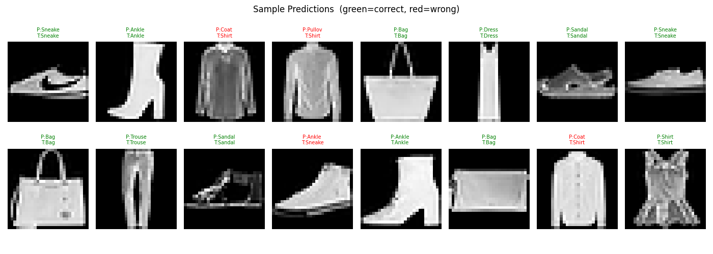

# CNN from Scratch — Fashion MNIST

**Name:** Nischay V M  
**SRN:** PES1PG25CS111  
**Course:** Deep Learning Theory and Practice (DLTP) — Assignment 1

---

## Overview

This project implements a **Convolutional Neural Network (CNN) entirely from scratch using NumPy** — no PyTorch, no TensorFlow, no Keras. Every layer, every gradient, every weight update is hand-coded to demystify how CNNs actually work under the hood.

The model is trained and evaluated on **Fashion-MNIST**, a dataset of 70,000 grayscale clothing images across 10 classes.

**Final Results (5,000 train / 1,000 test samples, 10 epochs):**

| Metric | Value |
|---|---|
| Final Train Accuracy | 86.25% |
| Final Test Accuracy | 82.60% |
| Final Train Loss | 0.3959 |
| Final Test Loss | 0.4704 |

---

## Dataset — Fashion MNIST

| Property | Detail |
|---|---|
| Total images | 70,000 |
| Image size | 28 × 28 pixels, grayscale |
| Classes | 10 |
| Train split | 60,000 |
| Test split | 10,000 |

**Classes:** T-shirt/top, Trouser, Pullover, Dress, Coat, Sandal, Shirt, Sneaker, Bag, Ankle boot

The dataset is fetched automatically via `sklearn.datasets.fetch_openml`.

---

## Network Architecture

```
Input           :  (N, 1, 28, 28)
────────────────────────────────────────────────────
ConvLayer 1     :  8 filters, 3×3 kernel, padding=1
ReLU
MaxPoolLayer 1  :  2×2  →  (N, 8, 14, 14)
────────────────────────────────────────────────────
ConvLayer 2     :  16 filters, 3×3 kernel, padding=1
ReLU
MaxPoolLayer 2  :  2×2  →  (N, 16, 7, 7)
────────────────────────────────────────────────────
FlattenLayer    :  (N, 784)
────────────────────────────────────────────────────
FCLayer 1       :  784 → 128,  ReLU
FCLayer 2       :  128 → 10,   Linear
────────────────────────────────────────────────────
Softmax + Cross-Entropy Loss
```

**Optimizer:** SGD with Momentum (`lr=5e-3`, `momentum=0.9`)  
**Weight Init:** He initialisation for ReLU layers, Xavier for linear layers

---

## Code Structure

```
main.py
│
├── load_fashion_mnist()          # Downloads & preprocesses the dataset
│
├── relu() / relu_backward()      # ReLU activation + gradient
├── softmax()                     # Numerically stable softmax
├── cross_entropy_loss()          # Loss + combined softmax gradient
│
├── class ConvLayer               # Convolution layer
│   ├── forward()                 #   im2col + matrix multiply
│   └── backward()                #   dW, db, dx via col2im + einsum
│
├── class MaxPoolLayer            # Max pooling layer
│   ├── forward()                 #   non-overlapping 2×2 windows
│   └── backward()                #   gradient routed to max position
│
├── class FlattenLayer            # Reshape (N,C,H,W) ↔ (N, C*H*W)
│
├── class FCLayer                 # Fully-connected layer
│   ├── forward()                 #   x @ W + b, optional ReLU
│   └── backward()                #   dW, db, dx + SGD momentum update
│
├── class SimpleCNN               # Sequential model container
│   ├── forward()                 #   full forward pass
│   └── backward()                #   full backpropagation
│
├── train()                       # Training loop (epochs + mini-batches)
├── evaluate()                    # Loss & accuracy on any split
├── plot_history()                # Loss & accuracy curves across epochs
└── plot_predictions()            # Sample predictions visualisation
```

---

## Layer Implementation Details

### Convolution Layer

The forward pass uses **im2col** — a technique that reshapes the input into column vectors (one per receptive field) via `np.lib.stride_tricks.as_strided`, turning convolution into a single matrix multiply:

```
out = W_reshaped @ im2col(x)
```

The backward pass computes:
- `dW` — gradient w.r.t. filters via `einsum`
- `db` — gradient w.r.t. biases (sum over spatial dims)
- `dx` — gradient w.r.t. input via **col2im** (scatter operation)

### Max Pooling Layer

Non-overlapping windows are extracted by reshaping the input. The backward pass routes gradients only to the position that held the maximum value (ties are split equally).

### Fully Connected Layer

Standard `z = x @ W + b` with an optional ReLU gate. The output FC layer uses `activation='linear'` since softmax is fused with the loss for numerical stability.

### Loss Function

Softmax cross-entropy with the combined gradient:

```
∂L/∂logits = (softmax(logits) − one_hot(y)) / N
```

This is analytically clean and avoids vanishing gradients in the output layer.

---

## How to Run

### Prerequisites

```bash
pip install numpy matplotlib scikit-learn
```

### Run (demo mode — 5,000 samples)

```bash
python main.py
```

This uses 5,000 training and 1,000 test samples for a quick demo.

### Run on Full Dataset

Open `main.py` and change the limits near the bottom of the file:

```python
TRAIN_LIMIT = 60000   # was 5000
TEST_LIMIT  = 10000   # was 1000
```

Then run:

```bash
python main.py
```

Expected test accuracy: **~85–88%** with 10 epochs on the full dataset.

### Outputs

After training, two plots are saved in the same directory:

| File | Description |
|---|---|
| `training_curves.png` | Train vs. test loss and accuracy across epochs |
| `predictions.png` | Grid of 16 sample test predictions (green = correct) |

---

## Epoch-by-Epoch Results

| Epoch | Train Loss | Train Acc | Test Loss | Test Acc |
|:---:|:---:|:---:|:---:|:---:|
| 1 | 1.1963 | 57.73% | 0.7580 | 73.30% |
| 2 | 0.6917 | 75.40% | 0.6907 | 72.10% |
| 3 | 0.6065 | 78.32% | 0.5633 | 80.50% |
| 4 | 0.5366 | 80.81% | 0.5318 | 82.40% |
| 5 | 0.4924 | 82.85% | 0.5605 | 79.90% |
| 6 | 0.4812 | 83.31% | 0.5071 | 82.50% |
| 7 | 0.4554 | 83.39% | 0.5252 | 81.40% |
| 8 | 0.4373 | 84.38% | 0.5004 | 82.50% |
| 9 | 0.4158 | 85.70% | 0.4391 | 84.70% |
| 10 | 0.3959 | 86.25% | 0.4704 | 82.60% |

**Key observations:**
- Training loss decreases **consistently** every epoch — the network is learning.
- Test accuracy improves from 73% → 82.6% over 10 epochs.
- A small gap between train and test loss suggests mild overfitting, expected with only 5,000 training samples.
- The best test accuracy of **84.70%** occurs at Epoch 9.

---

## Training & Test Curves

The plots below show how training and test **loss** and **accuracy** evolve across each epoch. They are generated automatically at the end of training and saved to the `results/` folder.

### Loss across Epochs (Train vs. Test)



- **Train loss** (blue) drops steadily from ~1.20 → ~0.40, indicating the network is learning effectively.
- **Test loss** (red) also decreases overall, from ~0.76 → ~0.47, though with minor fluctuations — characteristic of mini-batch SGD.
- The narrowing gap between train and test loss from epoch 6 onward suggests the model is generalising well given the small dataset size.

### Accuracy across Epochs (Train vs. Test)

- **Train accuracy** rises from 57.73% → 86.25%, a gain of ~29 percentage points across 10 epochs.
- **Test accuracy** climbs from 73.30% → 82.60%, peaking at **84.70%** at Epoch 9.
- The test accuracy consistently lags behind train accuracy — a normal sign of mild overfitting, which would reduce further with more training data or regularisation (dropout, L2).

### Sample Predictions



Green titles indicate correct predictions; red titles indicate misclassifications. The model confidently distinguishes structured classes (Trouser, Sneaker, Bag) but occasionally confuses visually similar ones (Shirt vs. T-shirt, Coat vs. Pullover).

---

## Plotting Code

The `plot_history()` function generates the training/test loss and accuracy curves. It is called automatically at the end of training, but can also be called standalone:

```python
def plot_history(history, save_path="results/training_curves.png"):
    """
    Plots train vs. test loss and accuracy across epochs.

    Parameters
    ----------
    history   : dict with keys 'train_loss', 'train_acc', 'test_loss', 'test_acc'
                each a list of per-epoch values returned by train()
    save_path : path where the figure is saved
    """
    epochs = range(1, len(history['train_loss']) + 1)

    fig, (ax1, ax2) = plt.subplots(1, 2, figsize=(13, 5))
    fig.suptitle("CNN Training on Fashion-MNIST", fontsize=14, fontweight='bold')

    # ── Loss plot ──────────────────────────────────────────────────────────
    ax1.plot(epochs, history['train_loss'], 'b-o', markersize=4, label='Train Loss')
    ax1.plot(epochs, history['test_loss'],  'r-o', markersize=4, label='Test  Loss')
    ax1.set_xlabel('Epoch')
    ax1.set_ylabel('Cross-Entropy Loss')
    ax1.set_title('Loss per Epoch')
    ax1.legend()
    ax1.grid(alpha=0.3)

    # ── Accuracy plot ──────────────────────────────────────────────────────
    ax2.plot(epochs, [a * 100 for a in history['train_acc']], 'b-o', markersize=4, label='Train Acc')
    ax2.plot(epochs, [a * 100 for a in history['test_acc']],  'r-o', markersize=4, label='Test  Acc')
    ax2.set_xlabel('Epoch')
    ax2.set_ylabel('Accuracy (%)')
    ax2.set_title('Accuracy per Epoch')
    ax2.legend()
    ax2.grid(alpha=0.3)

    plt.tight_layout()
    plt.savefig(save_path, dpi=120)
    plt.show()
```

The `history` dictionary is returned by `train()` and contains four lists — one value per epoch:

```python
history = {
    'train_loss': [...],   # average cross-entropy loss over training batches
    'train_acc' : [...],   # average accuracy over training batches
    'test_loss' : [...],   # loss evaluated on the full test set
    'test_acc'  : [...],   # accuracy evaluated on the full test set
}
```

To reproduce the plots independently after training:

```python
# After calling train():
history = train(model, X_train, y_train, X_test, y_test, epochs=10, batch_size=64)
plot_history(history, save_path="results/training_curves.png")
plot_predictions(model, X_test, y_test, n=16, save_path="results/predictions.png")
```

---

## Dependencies

| Package | Purpose |
|---|---|
| `numpy` | All matrix operations, convolution, backprop |
| `matplotlib` | Plotting training curves and predictions |
| `scikit-learn` | Fetching the Fashion-MNIST dataset via OpenML |

No deep learning framework is used. The entire CNN is implemented in pure NumPy.

---

## Key Concepts Demonstrated

- **Convolution** as a linear operation (im2col trick)
- **Backpropagation through convolution** (col2im gradient)
- **Max pooling** and its gradient (argmax masking)
- **Fully connected layers** with He / Xavier weight initialisation
- **Softmax + cross-entropy** fused for stable gradient computation
- **SGD with momentum** for weight updates
- **Mini-batch training** with epoch-level evaluation on train and test splits